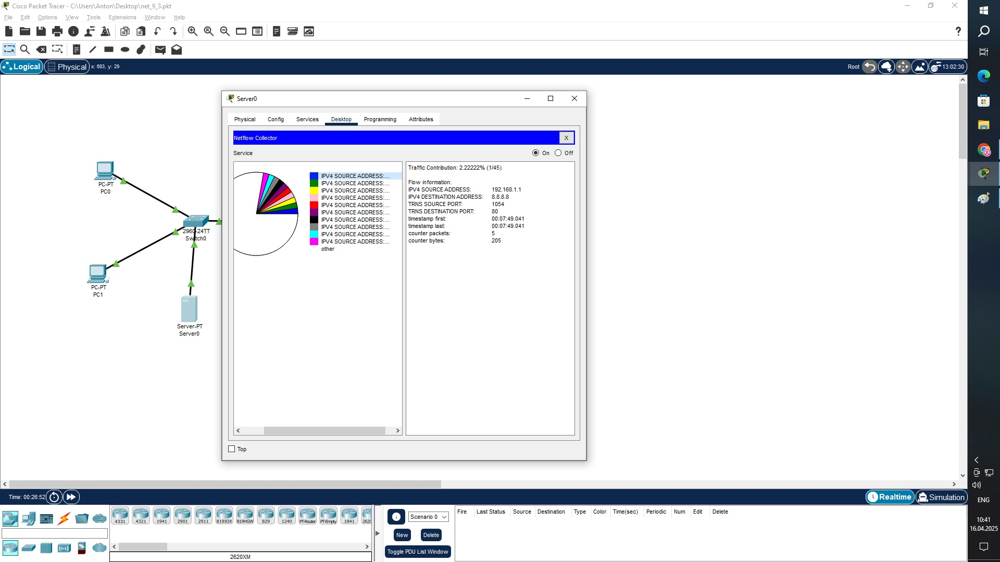
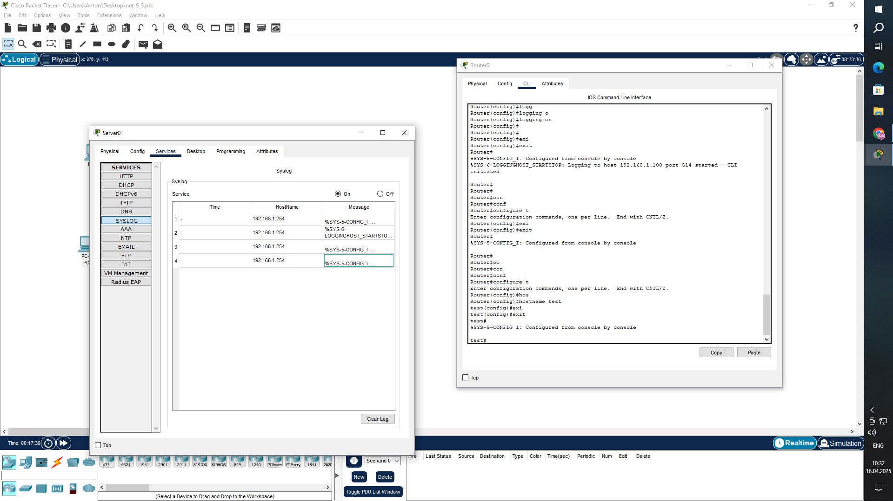

# Задание 1.

Сконфигурировать NetFlow на маршрутизаторе для отправки данных на сервер.

NetFlow должен собирать следующие параметры из трафика:

Source/Destination IP
ToS byte, tcp flags
next-hop
IP адресация произвольная.

Запустите пинги и телнеты на разные порты между двумя компьютерами.

Пришлите конфигурацию маршрутизатора и скрины NetFlow коллектора

# Ответ:

...

test#show running-config 
Building configuration...

Current configuration : 1144 bytes
!
version 15.4
no service timestamps log datetime msec
no service timestamps debug datetime msec
no service password-encryption
!
hostname test
!
!
!
!
!
!
!
!
ip cef
no ipv6 cef
!
!
!
!
!
flow exporter TEST_FE
 destination 192.168.1.100
 transport udp 9996
!
flow record TEST_FR
 match ipv4 source address
 match ipv4 destination address
 match transport source-port
 match transport destination-port
 collect timestamp sys-uptime first
 collect timestamp sys-uptime last
 collect counter packets
 collect counter bytes
!
flow monitor TEST_FM
 record TEST_FR
 exporter TEST_FE
!
!
!
!
!
!
!
!
!
spanning-tree mode pvst
!
!
!
!
!
!
interface GigabitEthernet0/0/0
 ip flow monitor TEST_FM output
 ip flow monitor TEST_FM input
 ip address 192.168.1.254 255.255.255.0
 duplex auto
 speed auto
!
interface GigabitEthernet0/0/1
 ip address 8.8.8.1 255.255.255.0
 duplex auto
 speed auto
!
interface GigabitEthernet0/0/2
 no ip address
 duplex auto
 speed auto
 shutdown
!
interface Vlan1
 no ip address
 shutdown
!
ip classless
!
ip flow-export version 9
!
!
!
!
!
!
!
logging 192.168.1.100
line con 0
!
line aux 0
!
line vty 0 4
 login
!
!
!
end

...

# Задание 2.

Сконфигурировать Syslog на маршрутизаторе для отправки данных на сервер.

Выключите gi0/1 на интерфейсе маршрутизатора и получите syslog сообщение на сервере.

Пришлите конфигурацию маршрутизатора и скрины полученных логов

# Ответ:

